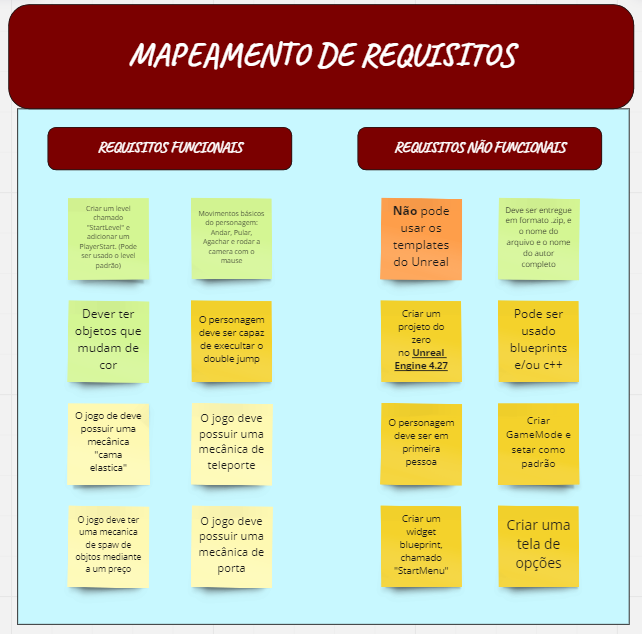
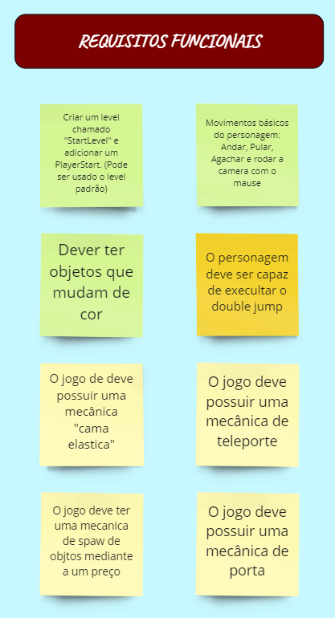
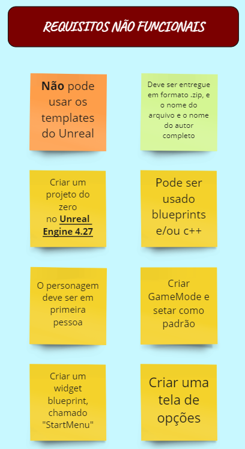
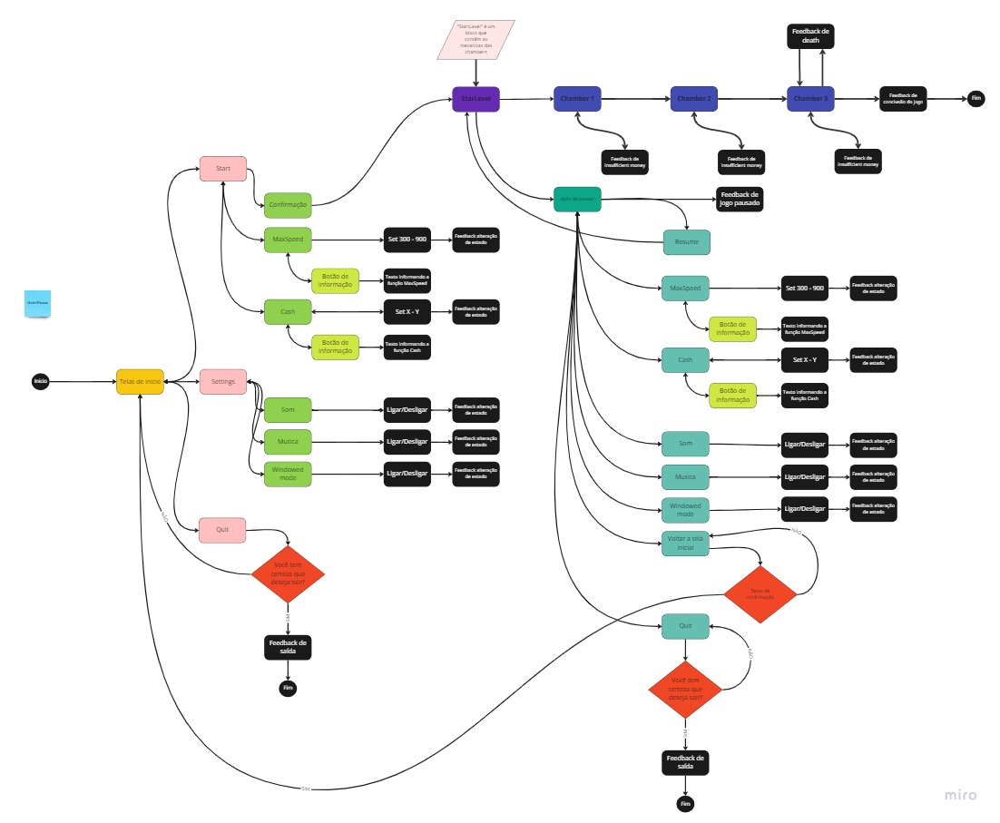
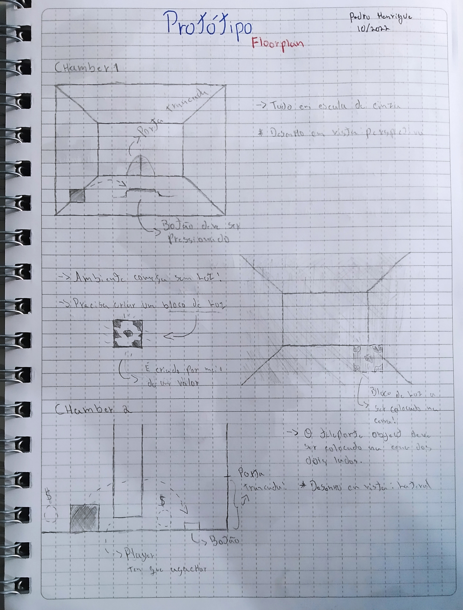
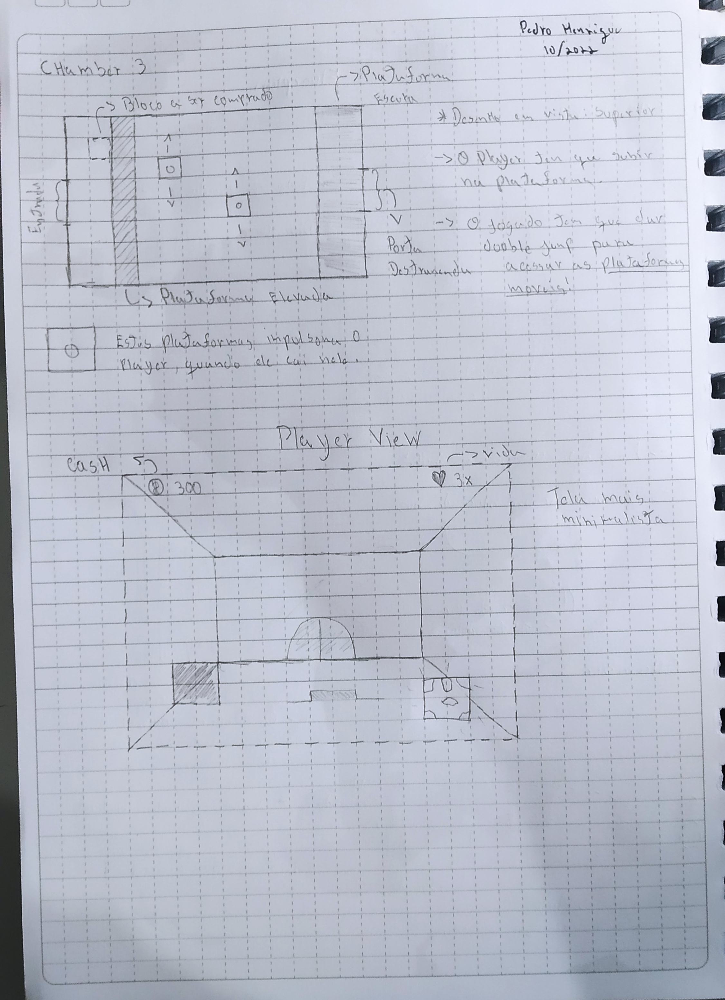

`Análise em andamento, arquivo sujeito a modificações!`

# Análise de Técnicas para Desenvolvimento de Games 
# INTRODUÇÃO

Segundo Nolan Bushnell, o fundamento básico do jogo é ser “fácil de aprender e difícil de dominar”, sendo que a classe de regras que circunda cada tipo de jogo varia de acordo com o objetivo do jogo (sério, cotidiano, diversão). Estando definido ainda como uma atividade livre, estruturados em certos limites de tempos e espaços (plataforma, VR, VM, mundo aberto, entre outros).

Os requisitos básicos utilizados para esta análise de técnicas voltadas para desenvolvimento de jogos, será o documento [IM Learning Project](https://github.com/Pedro-Alvess/Analise_de_tecnicas_para_dev_game/blob/main/Planejamento/IM%20Learning%20Project.pdf), da empresa [IM Designs](https://www.imdesigns.technology/). Todo o projeto irá fazer uso das ferramentas e metodologias do design centrado no usuário, que tem por princípios desde sua concepção e durante todo o seu desenvolvimento, um sistema interativo. Após a fase de planejamento, acontecerá a etapa de desenvolvimento do jogo, que usará a Unreal Engine 4.27. 

Na seção de [Planejamento](#planejamento) será apresentado o mapeamento dos requisitos funcionais e não funcionais do jogo, em seguida é descrita por meio de fluxogramas o user flow do player e, por fim, a prototipação e detalhamento do level “StartLevel”.

# PLANEJAMENTO
## Requisitos
Os requisitos em engenharia de software e IHC (interação humano computador), pode ser separado em dois tipos principais, os chamados requisitos funcionais, que tem por objetivo definir as funções que o software/solução deve fornecer, como ele deve reagir a entradas específicas e como se comportar em determinadas situações. E os requisitos não funcionais, que por definição são restrições sobre as funções oferecidas pelo software tais como tempo de execução, processo de desenvolvimento, padrão de codificação e entre outros. A seguir é possível ver o resultado (figuras 1, 1.1 e 1.2) da extração dos requisitos do pdf [IM Learning Project](https://github.com/Pedro-Alvess/Analise_de_tecnicas_para_dev_game/blob/ed1df01c550bd4ff006904b014d03e82f1e749e5/Planejamento/IM%20Learning%20Project.pdf). 

` Figura 1 - Visão geral do Board de Mapeamento de Requisitos`

` Figura 1.1 - Visão específica dos Requisitos Funcionais`

` Figura 1.2 - Visão específica dos Requisitos Não Funcionais`

A ferramenta utilizada para auxiliar na organização do board da figura 1 foi o miro, caso você deseje visualizar melhor o board e o fluxograma que será apresentado nas próximas seções acesse este [link](https://miro.com/app/board/uXjVPMncARE=/?share_link_id=795185664950https://miro.com/app/board/uXjVPMncARE=/?share_link_id=795185664950).  

## UserFlow
Quando desenvolvemos soluções centradas no usuário, comumente é realizado o user flow de navegação dentro do sistema, por meio deste diagrama podemos confrontar as interações que o usuário poderá executar na aplicação, segundo o site [Lucidchart](https://www.lucidchart.com/blog/how-to-make-a-user-flow-diagram) este mapeamento e visualização de ações irá auxiliar em:  

- Na facilitação da comunicação de qual deverá ser o fluxo do usuário;

- Ter certeza de não perder passos importantes do processo;

- Realizar decisões e alterações de baixa fidelidade antes de investir muito tempo no design;

- Ter feedback de diferentes stakeholders;

Na figura 2 você irá encontrar um overview do diagrama de user flow, para melhor visualização acesse o site do [miro](https://miro.com/app/board/uXjVPMncARE=/?moveToWidget=3458764536638153723&cot=14). 

`Figura 2 - Overview do user flow`

## Prototipação - Floorplan

O floorplan (planta baixa) é largamente utilizado na indústria de jogos para para que os games designers  possam ter uma ideia geral das disposições das mecânicas, objetos e desafios da cena. Além disto o professor e doutor Marcos Arrais sintetiza os benefícios desta prototipação como: 

- Oferece uma percepção dos leveis do jogo nos aspectos de: desafios, interações e tempo;

- Metodologia de prototipação de baixo custo e rápida;

- Deve ser utilizado para cada level do jogo;

- Evita a construção de jogos entediantes e/ou com muita intensidade de interações que deixe o jogo exaustivo e cansativo;

Nas figuras 3 e 4 é apresentado o floorplan baseado nas mecânicas exigidas nos requisitos funcionais, e no final da figura 4 há um esboço da cam view do player em um design mais minimalista.

`Figura 3 - Floorplan`

`Figura 4 - Floorplan e Player's view`

